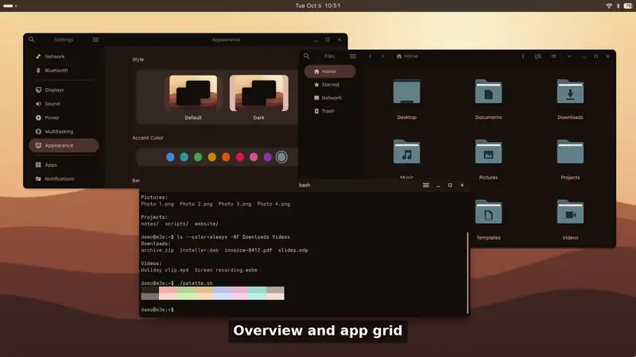

# m3e-gnome

[](https://github.com/maximeallanic/m3e-gnome/actions/workflows/ci.yml)
[](LICENSE)
[](docs/compatibility.md)

[English](README.md) | Français

Un habillage Material 3 Expressive (M3E) pour GNOME 50. La palette de couleurs est calculée à partir du fond d'écran,
comme le fait Material You sur Android, puis appliquée à GTK 3, GTK 4 / libadwaita, GNOME Shell, aux icônes, au
curseur, aux sons et à la police. Trois extensions Shell complémentaires ajoutent le mouvement et quelques détails
façon Android que le CSS ne sait pas faire.

La documentation détaillée est en anglais ([docs/index.md](docs/index.md)) ; ce fichier en est la traduction fidèle
pour le README.

<!-- screenshots:start -->
<p align="center">
  <a href="screenshots/animations.mp4">
    
  </a>
  <br><sub>Les animations (15 s, mouvement à ressorts). <a href="screenshots/animations.mp4">MP4 pleine qualité</a>.</sub>
</p>

<p align="center">
  <picture>
    <source media="(prefers-color-scheme: light)" srcset="screenshots/desktop-light.png">
    
  </picture>
</p>

<table>
  <tr><th>Sombre</th><th>Clair</th></tr>
  <tr><td colspan="2" align="center">Vue d'ensemble</td></tr>
  <tr>
    <td></td>
    <td></td>
  </tr>
  <tr><td colspan="2" align="center">Réglages rapides</td></tr>
  <tr>
    <td></td>
    <td></td>
  </tr>
  <tr><td colspan="2" align="center">Notifications et calendrier</td></tr>
  <tr>
    <td></td>
    <td></td>
  </tr>
  <tr><td colspan="2" align="center">Grille d'applications</td></tr>
  <tr>
    <td></td>
    <td></td>
  </tr>
  <tr><td colspan="2" align="center">Paramètres, GTK 4 / libadwaita</td></tr>
  <tr>
    <td></td>
    <td></td>
  </tr>
  <tr><td colspan="2" align="center">Fichiers, GTK 4 / libadwaita</td></tr>
  <tr>
    <td></td>
    <td></td>
  </tr>
  <tr><td colspan="2" align="center">Terminal</td></tr>
  <tr>
    <td></td>
    <td></td>
  </tr>
  <tr><td colspan="2" align="center">Dialogues</td></tr>
  <tr>
    <td></td>
    <td></td>
  </tr>
  <tr><td colspan="2" align="center">Barre d'état (façon Android, avec la pastille de batterie) et réglages rapides</td></tr>
  <tr>
    <td></td>
    <td></td>
  </tr>
</table>

<p align="center">
  
  <br><sub>Écran de connexion GDM (optionnel), voir <a href="docs/gdm.md">docs/gdm.md</a> (en anglais ; fond uni : pas de fond d'écran dans la capture).</sub>
</p>

<p align="center">
  
</p>

<p align="center">
  
</p>

Toutes les captures viennent d'un GNOME Shell imbriqué sans affichage, avec des données de démonstration et des fonds d'écran générés (CC0) ; voir [screenshots/README.md](screenshots/README.md) pour les régénérer.
<!-- screenshots:end -->

## Pourquoi

L'apparence de GNOME est neutre et la couleur d'accent se limite à quelques préréglages. Si vous aimez l'aspect et le
mouvement d'Android 16 et suivants (surfaces teintées, commandes en pilule, ressorts plutôt que des courbes à durée
fixe) et que vous les voulez sur le bureau, ce projet le fait sans recompiler mutter ni GNOME Shell : ce sont du CSS,
des modèles, quelques scripts et des extensions Shell, le tout dans votre dossier personnel.

Il s'adresse à celles et ceux qui utilisent GNOME 50 et acceptent un thème qui suit le fond d'écran, remplace le thème
d'icônes, le curseur, le thème sonore et la police d'interface, et change la façon dont le Shell s'anime. Tout ce que
l'installateur modifie est consigné, et `./uninstall.sh` remet les choses en place.

## Fonctionnalités

- **Palette issue du fond d'écran.** Couleur source extraite comme le `WallpaperColors` d'Android, rôles calculés avec
  [material-color-utilities](https://github.com/material-foundation/material-color-utilities) de Google (spécification
  de couleur 2025, tonal-spot, plateforme téléphone), rendus dans les thèmes par [matugen](https://github.com/InioX/matugen).
  Elle se met à jour quand le fond d'écran ou le réglage sombre/clair change.
- **GTK 3, GTK 4 et libadwaita.** [Material-Gnome](https://github.com/SakibShahariar/material-gnome-theme) comme base,
  avec par-dessus des composants M3E : boutons, interrupteurs (avec icônes dans la poignée), curseurs, barres de
  défilement, onglets, listes, menus, dialogues, champs de texte, et une seule géométrie de barre de titre (barre de
  40 px, boutons ronds de 30 px).
- **GNOME Shell.** Une feuille de style générée (`M3E-Shell`) qui couvre la barre du haut, les menus, les réglages
  rapides, le calendrier, les notifications, la vue d'ensemble, la grille d'applications, les dialogues, l'OSD,
  l'écran de verrouillage, la capture d'écran et le clavier virtuel.
- **Icônes.** Thème d'icônes symboliques `Material-Symbols` construit à partir de Material Symbols, avec repli sur
  Papirus (icônes d'applications en couleur, couleur des dossiers accordée à la palette).
- **Curseur.** Pointeurs Googlebook issus d'AOSP, construits en fichiers Xcursor, noir (par défaut) ou blanc.
- **Sons et police.** Thème sonore Materia ; Google Sans Flex comme police d'interface.
- **Mouvement.** Animations M3E à ressorts pour le Shell et les fenêtres, fournies par le compagnon
  [m3e-gnome-extensions](https://github.com/maximeallanic/m3e-gnome-extensions).
- **Aucun gras, nulle part.** Une règle voulue de ce thème (voir les [notes de conception](docs/design-notes.md), en anglais).
- **Réversible.** Chaque fichier et chaque réglage touchés par l'installateur sont consignés et sauvegardés.

## Prérequis et compatibilité

| | État |
|---|---|
| GNOME Shell 50 (validé sur 50.5) | Vérifié |
| Autres versions de GNOME | L'installateur avertit et continue ; non testé |
| Wayland | Vérifié (Shell imbriqué sans écran des bancs d'essai ; session quotidienne de l'auteur) |
| Session X11 | Non testé. Le CSS contient des règles pour les cadres de barre de titre X11 de mutter, mais aucune session X11 n'a été vérifiée |
| Debian | Vérifié (le test aller-retour de l'installateur a été exécuté pour de vrai sur Debian) |
| Ubuntu | Mêmes noms de paquets que Debian ; non testé |
| Fedora, Arch, openSUSE | Noms de paquets vérifiés comme du texte seulement ; non testé |
| Architecture | x86_64 pour le matugen téléchargé ; les autres architectures doivent compiler matugen elles-mêmes |

Il faut aussi l'extension GNOME **User Themes** (nécessaire pour charger un thème Shell), Python 3.9 ou plus récent,
Node.js et npm (pour le paquet de palette) et quelques outils courants. `./install.sh` les vérifie et affiche la
commande exacte pour votre distribution. Détails : [docs/installation.md](docs/installation.md) et
[docs/compatibility.md](docs/compatibility.md).

Seule la disposition XDG par défaut est prise en charge (`~/.config`, `~/.cache`, `~/.local/share`).

## Installation

Lancez-la depuis votre session GNOME (il faut `gsettings`/dconf et un bus de session), avec votre utilisateur, sans `sudo` :

```sh
git clone https://github.com/maximeallanic/m3e-gnome
cd m3e-gnome
./install.sh --dry-run        # affiche ce qui serait fait, ne change rien
./install.sh                  # installe
```

Puis **fermez la session et rouvrez-la** : le Shell, les extensions et les applications GTK chargent le thème à la
connexion. Enfin, lancez `./verify.sh`.

### Depuis une release

La [page des releases](https://github.com/maximeallanic/m3e-gnome/releases) propose un paquet Debian et une archive des
sources (vérifiez-les avec `sha256sum -c SHA256SUMS`). Les deux lancent le même installateur, avec votre utilisateur, et
téléchargent toujours les sources épinglées à l'exécution (réseau nécessaire) ; le paquet lui-même ne modifie rien dans
votre dossier personnel.

```sh
# Debian/Ubuntu : installe /usr/share/m3e-gnome et les commandes m3e-gnome-install, -uninstall et -verify
sudo apt install ./m3e-gnome_<version>_all.deb
m3e-gnome-install --dry-run && m3e-gnome-install
# toute distribution : l'archive contient le même arbre que le dépôt git
tar xzf m3e-gnome-<version>.tar.gz && cd m3e-gnome-<version> && ./install.sh --dry-run && ./install.sh
```

Si le paquet `gnome-shell-extension-m3e` (issu des releases de m3e-gnome-extensions) est installé, l'installateur active
ces extensions système au lieu de les télécharger. Retirer le `.deb` n'annule pas le thème : lancez d'abord
`m3e-gnome-uninstall`. Le `.deb` a seulement été vérifié en le dépaquetant, pas installé avec `dpkg` sur un système réel.

Si le thème Shell ne se charge pas, installez l'extension User Themes et relancez `./install.sh`. Pour les paquets
système manquants : `./install.sh --install-deps` lance votre gestionnaire de paquets avec `sudo`, après avoir affiché
la commande et demandé confirmation.

| Option | Effet |
|---|---|
| `--dry-run` | Affiche les actions, ne change rien |
| `-y`, `--yes` | Ne demande pas de confirmation |
| `--install-deps` | Installe les paquets système manquants avec `sudo` (demande d'abord) |
| `--dark` / `--light` | Schéma de couleurs à appliquer (`--dark` par défaut) ; `--keep-color-scheme` ne le change pas |
| `--cursor black\|white` | Variante du curseur (`black` par défaut) |
| `--no-extensions` | N'installe pas les extensions Shell complémentaires |
| `--extensions-only` | N'installe que les extensions complémentaires |
| `--extensions-dir DIR` | Utilise une copie locale de `m3e-gnome-extensions` au lieu de la télécharger |
| `--skip STEP` | Saute une étape, répétable : `gtk-theme icons cursor sounds font palette extensions` |
| `--gdm` | **Optionnel** : habille aussi l'écran de connexion GDM. Utilise `sudo` pour cette étape seulement, après avoir affiché le plan exact. Voir [docs/gdm.md](docs/gdm.md) (en anglais) |
| `--gdm-only` | Seulement l'étape GDM (après une installation complète) |
| `--gdm-image FILE` | Couleur source et fond flouté de l'écran de connexion (par défaut : votre fond d'écran sombre) |
| `--gdm-force` | Laisse l'assistant GDM tourner sur une version majeure de GNOME Shell non vérifiée |
| `--no-session-check` | N'exige pas de session GNOME active (paquetage, tests) |
| `--uninstall` | Équivaut à `./uninstall.sh` |
| `--version`, `-h`, `--help` | |

## Ce qui est installé, et où

| Quoi | Où |
|---|---|
| Thème GTK de base (Material-Gnome, graisses grasses retirées de son CSS GTK 4) | `~/.themes/Material-Gnome` |
| Thème Shell (généré) | `~/.themes/M3E-Shell` |
| Feuilles de style et modèles M3E | `~/.config/m3e-gnome/` |
| Points d'entrée GTK | `~/.config/gtk-3.0/gtk.css`, `~/.config/gtk-4.0/{gtk.css,gtk-dark.css,colors.css}` |
| Icônes : `Material-Symbols`, `Papirus`, `Papirus-Dark`, `Papirus-Symbolic` | `~/.local/share/icons/` |
| Curseur : `Googlebook` ou `Googlebook-White` (aussi `~/.icons/default`) | `~/.local/share/icons/` |
| Sons (`Materia`), police (Google Sans Flex) | `~/.local/share/sounds/`, `~/.local/share/fonts/` |
| Scripts de palette et matugen (s'il manque) | `~/.local/bin/`, `~/.local/lib/material-palette/` |
| Service de palette | `~/.config/systemd/user/material-sync.service` |
| Extensions complémentaires | `~/.local/share/gnome-shell/extensions/` |
| Liste des chemins possédés, sauvegardes, `restore.sh` | `~/.local/share/m3e-gnome/{manifest,backup/<horodatage>/}` |
| Cache de téléchargement | `~/.cache/m3e-gnome/` |

L'installateur règle aussi des paramètres GNOME (noms des thèmes GTK, d'icônes, de curseur, de sons et Shell, polices,
disposition des boutons, schéma de couleurs, User Themes, extensions) et la palette de Ptyxis si Ptyxis est installé.
Les anciennes valeurs sont sauvegardées d'abord. Voir [docs/architecture.md](docs/architecture.md).

## Comment les couleurs suivent le fond d'écran

Un service utilisateur (`material-sync.service`) surveille le fond d'écran, le schéma de couleurs et les extensions
actives avec `dconf watch`. Après un changement, il choisit l'image source (fond GNOME : `picture-uri-dark` en mode
sombre, `picture-uri` en mode clair), calcule la palette, rend chaque modèle avec matugen, recharge les thèmes Shell et
GTK, et règle l'accent GNOME et la couleur des dossiers Papirus les plus proches. Les applications GTK 4 et Chrome
prennent les nouvelles couleurs à leur redémarrage. Personnalisation : [docs/customization.md](docs/customization.md).

## Mise à jour

```sh
cd m3e-gnome
git pull
./install.sh        # idempotent : réinstalle ce qui a changé
```

Les sources tierces sont figées sur des commits ou des sommes de contrôle exacts dans `lib/pins.sh` : c'est donc un
`git pull` qui les fait avancer.

## Désinstallation et restauration

```sh
./uninstall.sh --dry-run
./uninstall.sh
```

Cela ne retire que les chemins consignés dans `~/.local/share/m3e-gnome/manifest` (jamais par motif), remet les
fichiers remplacés et les anciens paramètres GNOME depuis `~/.local/share/m3e-gnome/backup/<horodatage>/`, puis vous
invite à vous déconnecter et reconnecter. Détails : [docs/troubleshooting.md](docs/troubleshooting.md).

## Limites connues

- **Chrome** exige *Paramètres > Apparence > Thème : GTK* pour utiliser le thème, et garde une barre d'outils et un
  onglet actif sombres en mode clair (voir la [compatibilité](docs/compatibility.md)).
- **Les applications Qt et les fenêtres libdecor** ne sont pas habillées par le CSS GTK : les décorations Qt ne le
  suivent pas, et libdecor et les cadres X11 de mutter dessinent leurs propres ombres (bas aux angles droits).
- **Écran de connexion GDM : optionnel, vérifié seulement sur la famille Debian.** `./install.sh --gdm` l'habille par
  un assistant root qui traite tout ce que prépare l'installateur comme des données non fiables (modèle de sécurité :
  [docs/gdm.md](docs/gdm.md), en anglais). Vérifié dans une fausse racine système et par un Shell imbriqué sur Debian ;
  pas encore essayé sur un vrai démarrage d'autres distributions. Les couleurs de l'écran de connexion sont figées à
  l'installation.
- **Applications Flatpak :** rien dans l'installateur ne donne aux applications isolées accès au thème ni aux feuilles
  de style de l'utilisateur. Non testé.
- Validé sur GNOME 50.5 uniquement ; les extensions modifient des classes privées du Shell.
- Les animations de libadwaita écrites en dur dans la bibliothèque ne peuvent pas être restylées en CSS.
- Quelques surfaces du Shell sont des approximations, car St (la boîte à outils du Shell) ne sait pas exprimer la forme
  Material.

Liste complète : [docs/compatibility.md](docs/compatibility.md), [docs/troubleshooting.md](docs/troubleshooting.md).

## Documentation

[docs/index.md](docs/index.md) (en anglais) : installation, personnalisation, architecture, compatibilité, dépannage,
notes de conception, développement, FAQ.

## Dépôts liés

- [m3e-gnome-extensions](https://github.com/maximeallanic/m3e-gnome-extensions) : M3E Motion, M3E for Extensions et
  Status Bar (GNOME Shell 50).

## Langue

Le thème ne dessine aucun texte, il fonctionne donc dans toutes les langues de GNOME ; les extensions n'ont aucune
chaîne d'interface. Les pourcentages de la barre d'état utilisent `Intl.NumberFormat`. La sortie des outils que
l'installateur analyse est lue avec `LC_ALL=C`.

## Contribuer

Voir [CONTRIBUTING.md](CONTRIBUTING.md) et [docs/development.md](docs/development.md) (en anglais). Signalements de
sécurité : [SECURITY.md](SECURITY.md). Changements : [CHANGELOG.md](CHANGELOG.md).

## Crédits

- [Material-Gnome](https://github.com/SakibShahariar/material-gnome-theme) de Sakib Shahriar Shimanto (GPL-3.0 ou ultérieure) : le thème GTK 3/4 de base.
- [Thème d'icônes Papirus](https://github.com/PapirusDevelopmentTeam/papirus-icon-theme) et papirus-folders.
- [matugen](https://github.com/InioX/matugen) : moteur de modèles.
- [material-color-utilities](https://github.com/material-foundation/material-color-utilities) : calcul de la palette.
- [Material Symbols](https://github.com/google/material-design-icons) (Apache-2.0).
- Dessins vectoriels des pointeurs d'AOSP (Apache-2.0), utilisés pour construire le curseur Googlebook.
- [Google Sans Flex](https://github.com/google/fonts/tree/main/ofl/googlesansflex) (SIL OFL 1.1).
- [Thème sonore Materia](https://github.com/nana-4/materia-sound-theme).
- Jetons Material 3 et valeurs de mouvement d'AndroidX et de Material Components (Apache-2.0).

Le code tiers est récupéré à l'installation, à un commit figé, et n'est jamais versé dans ce dépôt. Licences et
usage exact : [NOTICE.md](NOTICE.md). Material Design, Android, Pixel et Google sont des marques de Google LLC ; ce
projet n'est affilié ni à Google, ni à GNOME, ni à aucun des projets ci-dessus, et n'est pas soutenu par eux.

## Licence

[MIT](LICENSE) pour le code et les ressources originales de ce dépôt. Les composants tiers gardent leur propre licence
([NOTICE.md](NOTICE.md)).
