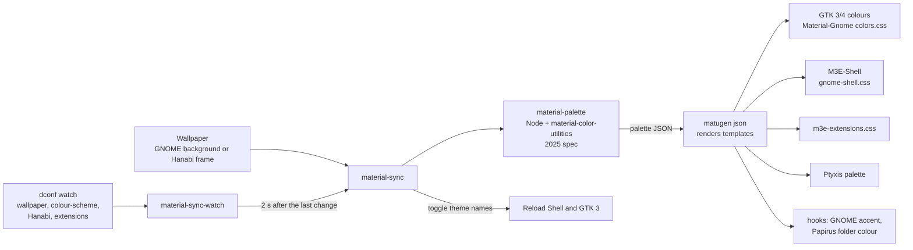

# Architecture

## Pipeline

1. **Source image.** `theme/bin/material-sync` picks the image (see [customisation](customization.md)).
2. **Palette.** `theme/bin/material-palette` runs the bundle built from `tools/material-palette`: the seed colour is
   extracted from the image the way Android's `WallpaperColors` does (image reduced, Celebi quantizer, scoring), then
   the scheme and all colour roles are computed with Google's `@material/material-color-utilities` (pinned by
   `package-lock.json`) in the 2025 spec, phone platform. The output is JSON in the shape `matugen json` expects.
3. **Templates.** matugen only renders templates here. It cannot compute the palette itself: matugen 4.2 knows the 2021
   colour spec only, which gives different roles from a current Pixel. matugen is always given
   `--config ~/.config/m3e-gnome/matugen/config.toml`, so a personal `~/.config/matugen/` is never read or replaced.
4. **Outputs.**
   - GTK colours: `~/.themes/Material-Gnome/gtk-{3,4}.0/colors.css` rendered from the base theme's
     `colors-template.css`.
   - Shell: the Shell stylesheet is split into 21 parts (`theme/shell/m3e-shell/NN-*.css`, one concern each). matugen
     renders each part to `~/.cache/m3e-gnome/shell/`, and the `post_hook` of the last part concatenates them, in order,
     into `~/.themes/M3E-Shell/gnome-shell/gnome-shell.css`. They are concatenated rather than `@import`ed because St
     gives imported sheets a lower priority than the main one.
   - `~/.config/m3e-gnome/m3e-extensions.css`: the stylesheet the `m3e-extensions` extension loads.
   - The Ptyxis `material` palette, the GNOME accent and the Papirus folder colour.
5. **Reload.** `material-sync` sets the `user-theme` name to empty and back to `M3E-Shell` (St only reloads on a name
   change), and switches `gtk-theme` to `Adwaita` and back to `Material-Gnome` (GTK 3 re-reads on a name change).
   GTK 4 applications read `~/.config/gtk-4.0` at startup.

## GTK stylesheet cascade

`~/.config/gtk-4.0/gtk.css` and `gtk-dark.css` import, in this order: the Material-Gnome stylesheet, the generated
spring table (`m3e-gtk4-motion.css`), `m3e-gtk4.css` (an index that imports the component parts), `window-buttons-gtk4.css`
and `no-bold-gtk4.css`. `~/.config/gtk-3.0/gtk.css` imports `m3e-gtk3.css`, `window-buttons-gtk3.css` and
`no-bold-gtk3.css`. Chrome reads GTK 4, so these files style it too. `~/.config/gtk-4.0/colors.css` is a link to the
generated colours.

M3E rules use `:not(#m3e)` to get identifier-level specificity (GTK does not count `:not()`).

## Services and scripts

| Piece | Role |
|---|---|
| `material-sync.service` (user unit) | Runs `material-sync` once at start (a failure does not stop the unit), then keeps `material-sync-watch` running; restarts on failure. Wanted by `graphical-session.target`. |
| `material-sync-watch` | `dconf watch /` filtered to the wallpaper, colour-scheme, Hanabi and enabled-extension keys; debounces 2 s. |
| `material-sync` | Image choice, palette, reload; one run at a time (`flock`); skips unchanged input. |
| `material-palette` | Palette computation and `matugen json` call. |
| `ptyxis-active-tab` | Optional, manual. |

## Extensions

The companion repository `m3e-gnome-extensions` provides three GNOME Shell 50 extensions (UUIDs end in
`@maximeallanic.github.io`):

- `m3e-motion`: spring-driven choreographies (container transform, shared axis, fade), and M3E switch, slider, menu and
  quick-settings tile components. It also sets the `:m3e-first` / `:m3e-last` pseudo-classes the notification
  stylesheet uses.
- `m3e-extensions`: loads `m3e-extensions.css`, restyling third-party extensions, and animates Dash to Dock (optional).
- `status-bar`: Android-style status icons and battery pill. It relies on the `data-ink-width` attribute that the
  `Material-Symbols` icon theme writes into status icons.

The installer builds them with that repository's `scripts/install.sh --dest <staging>`, copies each directory to
`~/.local/share/gnome-shell/extensions/<uuid>`, and adds their UUIDs to `enabled-extensions` by editing the key directly
(the running Shell does not know a just-copied extension until the next login). It remembers which UUIDs it added so
that uninstall removes exactly those. See that repository's README for what the theme must provide to them.

Without the extensions the theme still works; it only lacks the motion and the pieces listed above.

## Icons and cursor

- `theme/icons/Material-Symbols`: committed symbolic icon theme, generated by `tools/material-symbols` from Material
  Symbols at a pinned commit. Status icons share a common ink grid and carry `data-ink-width`. The window-control icons
  are drawn by hand. Its fallback chain is intentionally short (only the symbolic icons of Papirus, then Adwaita and
  hicolor), because GTK indexes every inherited theme on each application start: a long chain made applications start
  noticeably slower.
- `tools/papirus-symbolic.py` builds `Papirus-Symbolic` from the Papirus symbolic folders; `Papirus-Dark`'s coloured
  folders are linked into `Material-Symbols`, which is why Papirus is installed alongside.
- `tools/googlebook-cursors`: downloads AOSP pointer VectorDrawables at a pinned commit, converts them to SVG, renders
  them with `rsvg-convert` at 24 to 96 px and encodes Xcursor files itself (no `xcursorgen`).

## Installer layout

`install.sh`, `uninstall.sh` and `verify.sh` source small files from `lib/`:

| File | Concern |
|---|---|
| `common.sh` | logging, dry run, paths, OS family |
| `pins.sh` | every pinned source (commit or sha256) |
| `manifest.sh` | ownership: everything created goes through `put_*` / `record_*` |
| `backup.sh` | backup of replaced files and dconf values, generated `restore.sh` |
| `fetch.sh`, `matugen.sh`, `deps.sh` | downloads, matugen, dependency detection |
| `settings.sh`, `steps_*.sh` | GNOME settings and the install steps |
| `uninstall.sh`, `verify_checks.sh` | the two other entry points |
| `enabled_extensions.py` | edits `enabled-extensions` |

State lives in `~/.local/share/m3e-gnome/`: `manifest` (the paths we own), `state`, and `backup/<timestamp>/` with
`files/`, `moved.list`, `dconf.tsv` and a standalone `restore.sh`.

## Pinned sources

Third-party code that cannot be embedded under the MIT licence is never committed. The installer fetches it from
upstream at the exact commit or checksum in `lib/pins.sh` (Material-Gnome, Papirus, papirus-folders, Materia sounds,
Google Sans Flex, matugen, and the AOSP and Material Symbols inputs of the build tools). See `NOTICE.md`.

## What is not here

No GDM theming (see the README), no recompiled mutter or GNOME Shell, nothing outside `$HOME` except package installation
you explicitly request with `--install-deps`.
